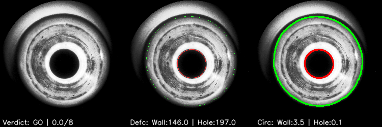

<!-- ABOUT THE PROJECT -->
## Tip QC



### Installation

Download the releases [here](https://github.com/Retorikal/tip_qc/releases/tag/latest).
* `dist-linux` can be used right away, but is about 267MB in size. Download and extract.
* (Recommended) `dist-py` or cloning this repo (if `pip` is available):
    ```bash
    ./setup.bash
    ```
    or
    ```bash
    pip install opencv-python-headless
    ```

### Usage
* from `dist-linux`, run the executable via command line
    ```bash
    cd dist-linux
    ./main
    ```
* from `dist-py` or cloning this repo, run the `main.py` script
    ```bash
    cd <cloned or extracted folder>
    python main.py
    ```

### Options
Running the executable:
* `-h, --help`  
Show the help message and exit
* `-i INPUT, --input INPUT`  
Directory to input files. Default: `./dataset`
* ` -o OUTPUT, --output OUTPUT`  
Directory to input files. Default: `./output`
* `-c CONFIG, --config CONFIG`  
Configuration file for scoring. Default: `./config.json`
* Example  
`main -i dataset -o output -c config.json`

### Configuration
Refer to the [example configuration](./config.json).
* `max_pass_thresh`: Max score that could pass. Anything over this is marked as `NG`
* `hole_defect`: Blobs of the glass detected over the hole
* `wall_defect`: Un-uniformness of the 'wall' : glass region outside the hole
* `hole_circular_deviation`: Deviation of the hole boundary from a perfect circle
* `wall_circular_deviation`: Deviation of the wall boundary from a perfect circle
* Parameters for `defect` and `circular_deviation` parameters:
    - `weight`: Score multiplier for this parameter
    - `threshs`: Scoring parameter stages, ordered from small to large. +1 score for every number in this parameter that is smaller than the evaluation result.

### Sample Output
* Overlay images are written to the output folder specified by `-o`, captioned with the following format:  
    ```
    Verdict: [GO/NG] | [Score]/[Max score that could pass]
    Defc: Wall:[Wall defect area size] | Hole:[Hole defect area size]
    Circ: Wall:[Wall circularity deviation score] | Hole:[Hole circularity deviation score]
    ```

* Console  
    ```
    /.../dataset/5451.png       GO
    /.../dataset/5655.png       NG
    /.../dataset/6267.png       NG
    /.../dataset/6063.png       GO
    ```

<!-- USAGE EXAMPLES -->
## Concept

A brief explanation of the analysis and proposed solution of the problem is presented below.

### Problem
From the sample images, it is clear that some of the tip end are not formed very cleanly, with some glass drooping out of their intended location, which seems like an overheating problem.  

Some challenge with the image processing are presents itself when the images are not taken in controlled conditions. 
* [Image 44](./dataset/44.png) does not have anything in it
* [Image 956](./dataset/956.png) has a glare on the corner of the image. 
* Some images has the body behind the tip visible, 
* All of the photos have bad contrast, making thresholding difficult. 
* Some defective region is the same on all images, suggesting dirty lenses
* Some picture are taken twice, but with differing quality. [Image 4752](./documentations/cropped/4752.png) depicts the same object with [Image 4757](./documentations/cropped/4757.png), but the former seems to be sheared horizontally. This is more pronounced on the cropped and contrast-balanced images available at the documentations

Overall, extracting information from transparent-material object is already quite tricky, and the less-controlled environment doesn't help much. Nevertheless, the program has already been well-equipped to handle edge cases as far as the sample dataset goes, which might or might not hold up to expanded edge cases.

### Solution

The process in this QC starts locating the tip hole, with the following steps:  

1. Histogram equalization, to fix the contrast. ([Results](/documentations/rebalanced/))
2. Thresholding to binary image
3. Binary image cleanup by contour filtering and morphological transformations
4. Hole identification by contour filtering

After the hole is located, the image is cropped out around it, resized, and a circular mask is applied to discard the contour which are not the tip. Only then quality checking can start.

1. Histogram equalization (again, since the back body of the tip is already cropped out)
2. Noise cleanup: Gaussian blur
3. Thresholding to binary image
4. Binary image cleanup with morphological transofrmations
5. Contour filtering to spot the hole and wall
6. With the hole and wall contour properly identified, each are subjected to defect and circularity check.
    * Defect check: A concave bound for the contour is created, and any stray blobs within it are marked as defective region
    * Circularity check: A circle with area equal to the concaved contour is created and compared to the contour bound with shape mathcing.

This process results in 4 metrics, which could be weighted and summed to decide if a particular tip qualifies (`GO`) or not (`NG`). The supplied example configuration should suffice as a good preliminary benchmark, but is possible to modify easily.


## Remarks
* As a proof of concept, the program's flow is not optimized to handle continuous operation, instead for reading a folder of images and batch-processing them.
* It is possible to do a full rewrite with OpenCV C++, and possibly quite easily. This is not done from the start to optimize development cycle instead of release performance.
* The program source code is structured as a [client](./main.py) and [API](./hole_detector.py) model. The API can easily be ported to anothe implementation.